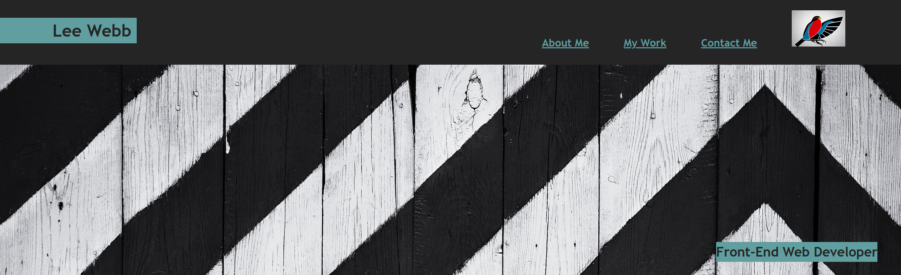
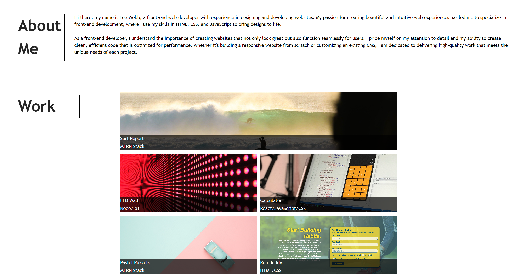

# Module-2-Challenge

# Creating a Demo Portfolio Challenge

## Description

I was tasked with creating a portfolio which will eventually be a vehicle to showcase my skills and talents to employers looking to fill full or part-time positons. My portfolio will eventually showcase my strongest work and my though processes behind it. I have been advised that students who have portfolios with deployed web applications (meaning they are live on the web) are typically very successful in their career search after this boot camp. Having several deployed projects is a minimum requirement to receive an initial interview at many companies. 

## Installation
Please visit this URL to see how the website looks now: https://halcyonlegion.github.io/Module-2-Challenge/

## Usage

Along the top of the page is my name along with 3 links which go to the named locations on the page. My icon the Halcyonic Bird features in the top right as I was not comfortable sharing my own photo.

The main section contains the about me, work and contact me areas all of which are linked up. I have nothing I care to link to the Work section just yet as a result it is just for demonstration purposes only as per the spec of this work.

The Contact Me section has links to Birmingham University, Github and Twitter, as well as a fake phone number.

## Credits

The University of Birmingham provided the materials and guides I used to get this started: https://www.birmingham.ac.uk/index.aspx

License
There is no license specified for this project.